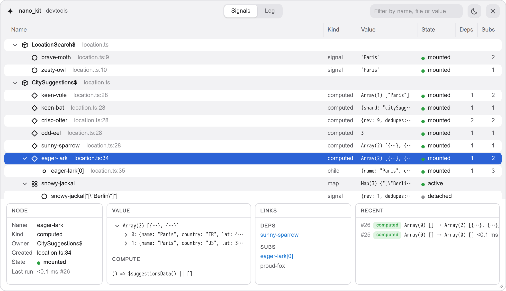
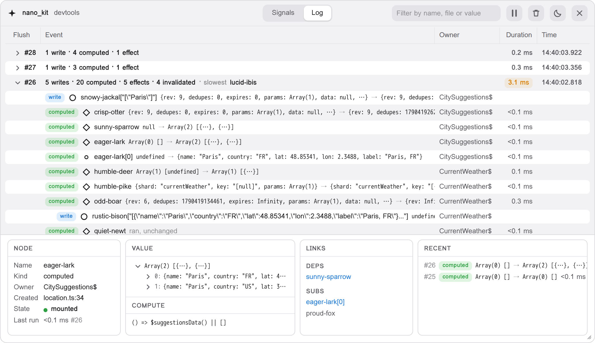

# @nano_kit/devtools

[![ESM-only package][package]][package-url]
[![NPM version][npm]][npm-url]
[![Dependencies status][deps]][deps-url]
[![Build status][build]][build-url]
[![Coverage status][coverage]][coverage-url]

[package]: https://img.shields.io/badge/package-ESM--only-ffe536.svg
[package-url]: https://nodejs.org/api/esm.html

[npm]: https://img.shields.io/npm/v/@nano_kit/devtools.svg
[npm-url]: https://npmjs.com/package/@nano_kit/devtools

[deps]: https://img.shields.io/librariesio/release/npm/@nano_kit/devtools
[deps-url]: https://libraries.io/npm/@nano_kit/devtools

[build]: https://img.shields.io/github/actions/workflow/status/TrigenSoftware/nano_kit/tests.yml?branch=main
[build-url]: https://github.com/TrigenSoftware/nano_kit/actions

[coverage]: https://img.shields.io/codecov/c/github/TrigenSoftware/nano_kit.svg
[coverage-url]: https://app.codecov.io/gh/TrigenSoftware/nano_kit

An in-page DevTools panel for [@nano_kit/store](../store): the reactive graph of your app, its values, its lifecycle and a log of every transaction, right on the page.

- **On the page**. A panel over your app in its own shadow root: no browser extension, no bundler plugin, and a strict Content Security Policy does not stop it.
- **Free in production**. The guarded call folds away with the whole package, and the core reports to the panel in its development build alone.
- **Named for you**. Every signal gets a readable name, the place it was created and its owner, the store factory, the component or the file, straight from the call stack.
- **Transactions, not events**. The log groups what happened by flush, with the time of every run and the slowest one called out.
- **Live values**. Pick any node to see its value as a tree, what it reads, what reads it, and its last lines in the log.

<picture>
  <source media="(prefers-color-scheme: dark)" srcset="../../website/src/assets/devtools-signals_dark.png">
  
</picture>

## Installation

```bash
pnpm add -D @nano_kit/devtools
# or
npm install -D @nano_kit/devtools
# or
yarn add -D @nano_kit/devtools
```

## Quick Start

Call `devtools()` once, behind the development flag of your bundler, and import it before the modules that create your stores, so their signals are named from the start:

```ts
import { devtools } from '@nano_kit/devtools'

if (import.meta.env.DEV) {
  devtools()
}
```

Open the panel with the pill at the bottom edge of the page, or with Alt+Shift+D / ⌥⇧D:

- **Signals**. Every signal, computed and child signal, grouped by the factory, component or file it was created in, with its value, state and links.
- **Log**. Every transaction: a write and all it caused, down to the effects that ran and how long each took.
- **Inspector**. The node you picked: its value, what it reads and what reads it, and its recent history.

<picture>
  <source media="(prefers-color-scheme: dark)" srcset="../../website/src/assets/devtools-log_dark.png">
  
</picture>

## Documentation

For guides and API reference, visit the [documentation website](https://nano-kit.js.org/devtools).
